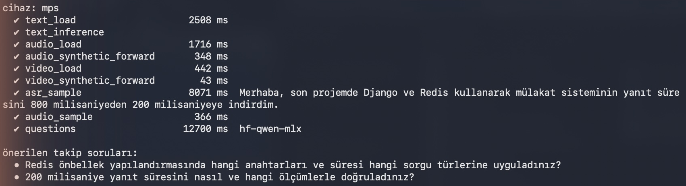
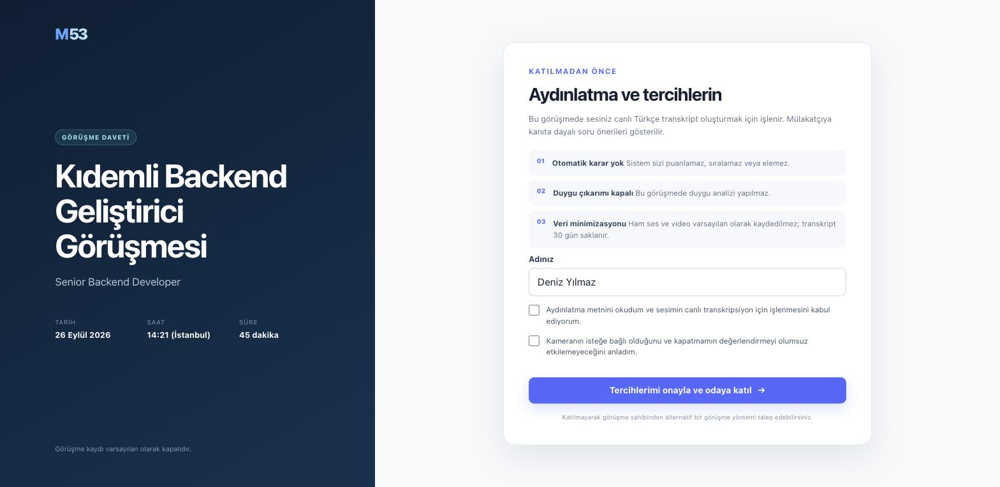

# M53


> **Staj notu (AVD Teknoloji Danışmanlık, 2026):** Bu repo, stajımın dördüncü haftasında üzerinde çalıştığım multimodal mülakat sisteminin kaynak kodudur. Altyapı (Docker/Compose/Kubernetes) denemeleri [m53-interview-infra](https://github.com/alimdemir/m53-interview-infra) reposunda. Bu repoya staj kapsamında eklenenler:
> - [`scripts/staj_demo_mac.sh`](scripts/staj_demo_mac.sh): Apple Silicon'da testler, gerçek modellerle `check_ai` ve demo sunucusunu tek komutla çalıştırır
> - [`notebooks/01_bulut_cpu_metin_duygu.ipynb`](notebooks/01_bulut_cpu_metin_duygu.ipynb): Türkçe metin duygu modelinin GPU'suz bir bulut örneğinde (Azure Machine Learning compute instance) çıkarım ve gecikme testi
> - Azure dağıtım betiklerinde abonelik kimliği, alan adı ve IP adresi koddan çıkarıldı. Bu değerler artık ortam değişkeninden ya da VM'nin Instance Metadata Service kaydından okunuyor.

PDF mimari planına bağlı, gerçek zamanlı ve insan denetimli mülakat destek sistemi. Django arayüzü güvenli aday davet bağlantısı üretir; iki katılımcıyı WebRTC ile görüştürür; Whisper ile Türkçe transkript ve Apple Silicon için Qwen3-4B-MLX ile kanıta bağlı takip soruları sunar.

## Staj kapsamında çalıştırma (Apple Silicon Mac)

`bash scripts/staj_demo_mac.sh` çıktısı: 52/52 test geçti. Ardından `check_ai` gerçek ağırlıklarla çalıştırıldı. Çalışma MPS üzerinde oldu. Türkçe sentetik ses Whisper ile hatasız yazıya döküldü ve Qwen3-4B (MLX) kanıta bağlı iki takip sorusu üretti.

| | |
|---|---|
| <br/>Gerçek modellerle `check_ai` özeti | <br/>Aday bağlantısı: aydınlatma ve tercih ekranı |

## Canlı altyazı ve Hugging Face koçluk modu

Görüşme odasındaki **CC** düğmesi iki katılımcı için de canlı Türkçe altyazıyı açar/kapatır. Görsel altyazıyı gizlemek, onay verilmiş transkripsiyonu durdurmaz. Ses üç saniyelik pencerelerde işlenir; bu bir kelime-kelime streaming ASR değildir. Gerçek gecikme model yüklemesi, donanım ve konuşmaya bağlıdır.

Yeni toplantı formunda **Koçluk / deneme oturumu** seçilirse her katılımcıya kendi verisi için ayrı analiz onayı gösterilir. Onay başta kapalıdır; kapatılınca geç kalan çıkarımlar da atılır. Duygu çıktıları **yalnız analizi açan katılımcının kendi soketine** gönderilir; karşı tarafa, soru motoruna veya veritabanına aktarılmaz. Yalnız onay olayı denetim kaydına yazılır. Bu mod işe alım değerlendirmesi için değildir.

| Kanal | Hazır model | Sınır |
|---|---|---|
| Metin | [Türkçe BERT emotion](https://huggingface.co/alperengozeten/bert-turkish-emotion) | 7 sınıf; eğitim verisi belgeleri eksik, saha doğrulaması yok |
| Ses | [Türkçe HuBERT / TurEV](https://huggingface.co/SeaBenSea/hubert-large-turkish-speech-emotion-recognition) | Angry, Calm, Happy, Sad; Türkçe görüşme alanına genelleme doğrulanmadı |
| Görüntü | [ViT face expression](https://huggingface.co/trpakov/vit-face-expression) | 7 yüz ifadesi sınıfı; kimlik tanıma yok, içsel duyguyu ölçmez |
| Sorular (Mac) | [Qwen3-4B 4-bit / MLX](https://huggingface.co/mlx-community/Qwen3-4B-4bit) | Apple Silicon üzerinde Türkçe takip sorusu + yeni aday yanıtı kanıt doğrulaması |
| Sorular (Azure/Linux) | [Qwen2.5-0.5B-Instruct](https://huggingface.co/Qwen/Qwen2.5-0.5B-Instruct) | CPU üzerinde yerel ve çevrimdışı üretim; şema/kanıt filtresinden geçmezse kural motoruna düşer |

Model skorları kalibre edilmiş doğruluk olasılıkları değildir. Ses modelindeki `Calm`, diğer modellerdeki `neutral` etiketiyle eşitlenmez. Sınıf uzayları farklı olduğu için kör ağırlıklı ortalama veya nihai duygu kararı üretilmez. Füzyon eklemeden önce ortak etiket tanımı, konuşmacıdan bağımsız Türkçe değerlendirme ve kalibrasyon gerekir. Hiçbir model işe alım puanı, sıralama, yalan/stres/kişilik teşhisi üretmez.

Mac M4 kurulumu (mevcut `.env` ve veritabanınızı koruyun):

```bash
.venv/bin/pip install -r requirements-mac.txt
.venv/bin/python scripts/download_models.py --profile mac
.venv/bin/python scripts/download_models.py --only whisper
.venv/bin/python manage.py migrate
.venv/bin/python manage.py seed_coaching
```

`.env` içinde `ASR_ENABLED=1`, `EMOTION_ENABLED=1`, `QUESTION_BACKEND=local`, `HF_DEVICE=auto` kullanın. `HF_DEVICE=auto` duygu modelleri için MPS/CPU seçer; soru modeli MLX nedeniyle Apple Silicon gerektirir. Tek uygulama süreciyle başlatın:

```bash
HF_HUB_OFFLINE=1 .venv/bin/python manage.py runserver 127.0.0.1:8000 --noreload
```

Public ağırlıkları indirmek için Hugging Face token gerekmez. Modeller ilk kullanımda **yerel dosyalardan** yüklenir; görüşme verileri Hugging Face'e gönderilmez. Model kartındaki lisans etiketi, eğitim verisinin her kullanım için uygun olduğunu garanti etmez.

Sınırlı kaynak yönetimi: ses kuyruğu en çok 9 saniye, video karesi yaklaşık 8 saniyede bir, ses/metin analizi ilk uygun pencereden başlayarak en sık 6 saniyede bir işlenir. Kişisel analiz bölümü kapatılınca onay da kapanır ve modeller durur. Adayın her 3 saniyelik altyazı parçasında soru üretmek yerine, son parçadan sonra 4,5 saniye sessizlik beklenir; yalnız yeni yanıt en sık 18 saniyede bir işlenir. Tek LLM işi çalışır, üç ardışık hatada model 60 saniye dinlendirilir. Yanıt şema/kanıt/konu filtresinden geçmezse güvenli kural motoru kullanılır.

“Bitir/Ayrıl” sırasında ses yakalama sonlandırılır, son kısa pencere de işlenir ve sunucu onayı beklenir. Bağlı karşı katılımcıya da kapanış hazırlığı gönderilir. Bekleme sınırlıdır (yerel altyazı için 10, karşı taraf için 12 saniye); tamamlanamayan veya düşürülen ses varsa uyarı gösterilir. Sekmeyi zorla kapatma/tarayıcı çökmesi bu güvenli kapanışın yerine geçmez.

Kontroller:

```bash
QUESTION_BACKEND=rules ASR_ENABLED=0 EMOTION_ENABLED=0 .venv/bin/python manage.py test
HF_HUB_OFFLINE=1 .venv/bin/python manage.py check_ai --audio tmp/ai-smoke-tr.aiff --report tmp/ai-smoke-report.json
node --test scripts/test_audio_capture.cjs scripts/test_emotion_display.cjs
```

`check_ai` gerçek ağırlıklarla **çalışabilirlik** testi yapar, doğruluk/başarı oranı ölçmez. Video kontrolünde sentetik görüntü, ses ileri geçiş kontrolünde sinüs kullanılır. İsteğe bağlı `--audio` için yalnız izinli test sesi kullanın. Mikrofon/kamera ile uçtan uca test ve farklı ağlardan TURN testi ayrı gereklidir. İnternete açık üretimde ayrı inference worker, Redis tabanlı iş/admission sınırları, güvenlik ve yük testi gerekir; bu tek süreçli yerel kurulum bunların yerine geçmez.

## Temel mülakat kapsamı

- Mülakatçı hesabı, toplantı planlama ve tekil/yenilenebilir aday bağlantısı
- Aday için aydınlatma, açık rıza ve kamera tercihi
- İki taraflı WebRTC kamera/ses görüşmesi
- Ayrı WebSocket hatlarında sinyalleşme ve 16 kHz PCM ses akışı
- `faster-whisper` + `whisper-large-v3-turbo` canlı Türkçe transkripsiyon adaptörü
- CV, ilan, rubrik ve final transkript `span_id` kanıtlarına bağlı Qwen soru motoru
- Sağlık, hamilelik, aile/medeni hal, yaş, din, siyaset, sendika ve etnik köken için deterministik son filtre
- Qwen erişilemezse aynı kanıt sözleşmesini koruyan güvenli kural motoru
- Kamera/mikrofon kapalıyken “veri yok” gösteren degrade-first arayüz
- Onay, bağlantı yenileme, soru seçimi/reddi ve toplantı bitirme audit olayları

Normal mülakat modu **duygu analizi yapmaz; aday puanlamaz, sıralamaz ve elemez.** Yukarıdaki kişisel koçluk modu ayrı ve isteğe bağlıdır. Ham ses/video kaydedilmez. Nihai karar ve önerilen soruyu sorma yetkisi insandadır.

## Yerelde çalıştırma

Python 3.12 önerilir.

```bash
python3.12 -m venv .venv
.venv/bin/pip install -r requirements.txt
.venv/bin/python manage.py migrate
.venv/bin/python manage.py seed_demo
.venv/bin/python manage.py runserver
```

Komutun yazdığı kullanıcı/parola ile `http://127.0.0.1:8000` adresinde giriş yapın. Örnek toplantının “Bağlantıyı kopyala” düğmesiyle aday lobisini gizli pencerede açabilirsiniz. Kamera/mikrofon tarayıcı güvenliği nedeniyle yalnız HTTPS veya `localhost` üzerinde çalışır.

Model olmadan toplantı, bağlantı, WebRTC ve güvenli kural tabanlı soru akışı çalışır. Whisper’ı yerelde etkinleştirmek için:

```bash
.venv/bin/pip install -r requirements-models.txt
.venv/bin/python scripts/download_models.py --only whisper
```

Bu proje `.env` dosyasını otomatik okur; süreç ortamındaki değerler önceliklidir. Mevcut `.env` dosyanızı örnek dosyayla ezmeyin. Örnek:

```bash
ASR_ENABLED=1 \
ASR_MODEL_PATH="$PWD/models/faster-whisper-large-v3-turbo" \
ASR_DEVICE=cpu \
ASR_COMPUTE_TYPE=int8 \
.venv/bin/python manage.py runserver
```

Apple Silicon üzerinde `large-v3-turbo` çalışabilir fakat canlı gecikme hedefi garanti edilmez. PDF’deki p95 hedefleri A100 üzerinde yük testiyle doğrulanmalıdır.

## Modelleri indirme

Mac profili aktif Qwen ve koçluk modellerini indirir; Whisper ayrı eklenir:

```bash
.venv/bin/pip install -r requirements-models.txt
.venv/bin/python scripts/download_models.py --profile mac
.venv/bin/python scripts/download_models.py --only whisper
```

Betik önce model boyutunu ve boş diski ölçer, en az 8 GB rezerv korur ve çözülen Hugging Face commit kimliklerini `models/model-lock.json` dosyasına yazar. Aktif model kümesi dışında eski 8B/vLLM ve 0.6B alternatifleri tutulmaz. Duygu modelleri İK karar hattına bağlanmaz.

Azure/Linux profili Mac'e özel MLX yerine `qwen-cpu` olarak Qwen2.5-0.5B-Instruct kullanır. Model sunucunun yerel diskinden, `HF_HUB_OFFLINE=1` ile çalışır; görüşme verisi harici bir model API'sine gönderilmez. Küçük CPU modeli ilk üretimde daha yavaştır ve çıktısı her zaman şema, kanıt ve konu filtrelerinden geçirilir; başarısız olursa güvenli kural motoru kullanılır.

## İnternetten katılım için gerekenler

Paylaşılabilir bağlantının başka ağlardan güvenilir çalışması için:

1. Alan adı ve geçerli HTTPS sertifikası
2. WebSocket destekli reverse proxy (Caddy profilde hazır)
3. Kuruma ait TURN sunucusu; yalnız genel STUN üretim için yeterli değildir
4. `ICE_SERVERS_JSON` içinde TURN adresi ve süreli kimlik bilgileri
5. Çoklu uygulama sürecinde Redis channel layer

Bu sürüm bire bir görüşme içindir. Üç veya daha fazla katılımcı için P2P yerine LiveKit/Janus/mediasoup gibi bir SFU katmanı eklenmelidir.

Azure (Poland Central) dağıtımı kendi alan adında Caddy/HTTPS, Redis, coturn ve tek ASGI süreci kullanır. Ağ güvenlik grubunda yalnız HTTP, HTTPS, SSH, TURN sinyali (`3478`) ve TURN UDP aktarım aralığı (`49160-49200`) açıktır. Sunucu, Azure yönetilen kimliğiyle her gece İstanbul saatiyle 23.00'te **deallocate** edilir; bu işlem yalnız işletim sistemini kapatmakla kalmaz, işlemci ücretini de durdurur. Yeniden kullanım için Azure portalından VM'yi başlatmak gerekir.

## Test

```bash
.venv/bin/python manage.py test
/opt/homebrew/opt/node@20/bin/node --test scripts/test_audio_capture.cjs scripts/test_emotion_display.cjs
.venv/bin/python manage.py check --deploy
```

`check --deploy` yerel geliştirme ayarlarında güvenlik uyarıları verir; üretimde `DJANGO_DEBUG=0`, güvenli çerezler, HTTPS yönlendirmesi ve gerçek bir secret key kullanılmalıdır.

## Koçlukta sonuç görünmüyorsa

Panel yalnız açık sekmenin kendi sesini, altyazısını ve kamera karesini analiz eder. Görüşmeci katılımcının özel sonucunu göremez. Aynı Mac üzerinde iki sekmeyle deneme yaparken diğer sekmenin mikrofonunu/kamerasını kapatın; çalıştığınız sekmede kişisel analiz onayını açın. Gerçek iki kişilik testte ayrı cihazlar ve kulaklık kullanın.

Paneldeki giriş göstergesi kullanılan mikrofonu, ses seviyesini, gönderilen ses süresini ve bu sekmeye ait son altyazının yaşını gösterir. Tarayıcı ses işlemeyi askıya alırsa “Ses işlemeyi sürdür” düğmesi çıkar. Ses kartındaki sunucu ölçümleri, hiç veri gelmemesini sessizlik nedeniyle reddedilen veriden ayırır. dBFS ve aktif süre bir duygu veya konuşma olasılığı değildir.

Kısa yanıtlar ilk uygun 3 saniyelik pencerede işlenir; sonrakiler enerji tasarrufu için en sık 6 saniyede bir örneklenir. Her kanal için bir çalışan ve en fazla bir güncel bekleyen pencere tutulur. Modeller aynı anda başlatılınca GPU erişimi sıraya alınır. 20 ms enerji pencereleri, kısa konuşmanın etrafındaki sessizlikle seyrelmesini önler; çok kısa darbeler ve sessizlik yine tahmin üretmez. ASR ayrıca kendi VAD filtresini uygular. Sonuç, sessizlik sırasında en fazla 20 saniye “Son tahmin” olarak gösterilir; güncel duygu gibi sunulmaz.

Yüz kırpımı [OpenCV YuNet 2023mar](https://huggingface.co/opencv/face_detection_yunet) ile bulunur. Tek, yeterince büyük ve net yüz yoksa ViT çalıştırılmaz. Kurulum:

```bash
.venv/bin/python scripts/download_models.py --only face-detector
```

Yerel MLX soru modelinin yüklenmesi ve üretimi tek kalıcı iş parçacığında çalışır. Böylece farklı Django isteklerinin [thread-local stream hatasına](https://github.com/ml-explore/mlx-lm/issues/1181) düşmesi önlenir. Meşgulken ikinci GPU işi kuyruğa yığılmaz; mevcut açık kural motoru alternatifi kullanılır.

İzinli/sentetik bir sesle gerçek modelleri canlı bağlantı akışında denemek için:

```bash
HF_HUB_OFFLINE=1 .venv/bin/python manage.py check_live_ai --audio test-sesi.wav
```

Bu kontrol veritabanı erişimlerini izole test verisiyle değiştirir; gerçek ASR, duygu modelleri ve soket akışını çalıştırır. Gerçek toplantıya yazmaz. Tarayıcı mikrofon yakalamasını veya kameranın gerçek yüzü algılamasını doğrulamaz; başarı model doğruluğu/kalibrasyonu anlamına gelmez.
